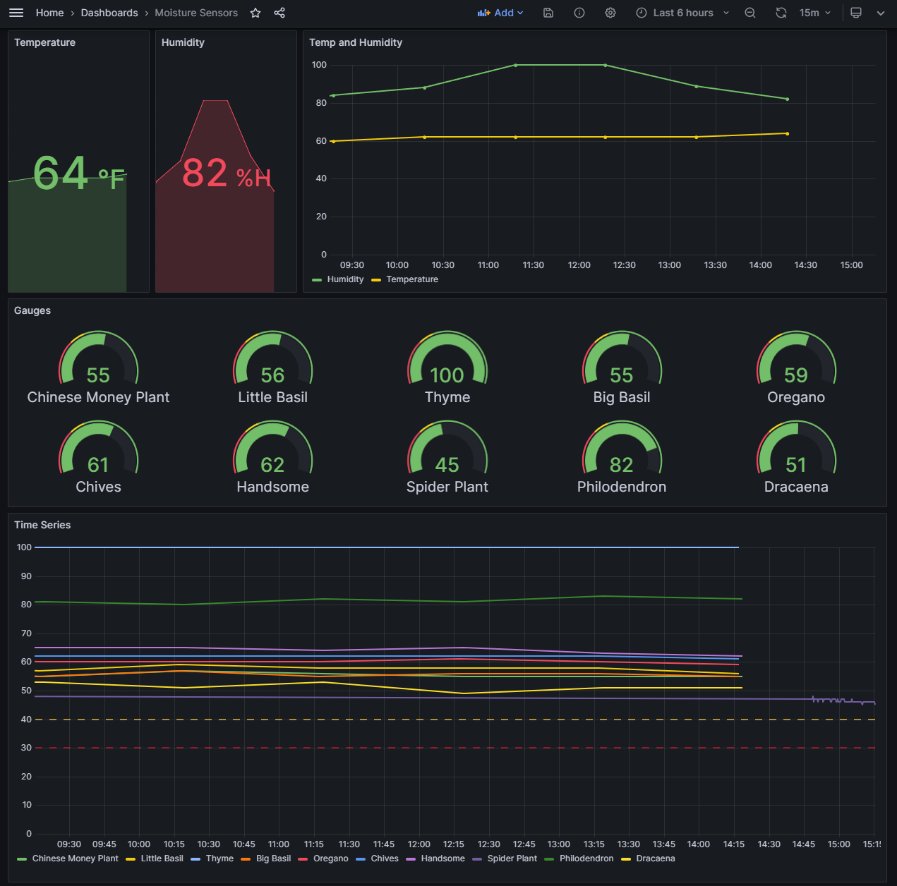

# Soil Moisture, Temp and Humidity Sensors
Send soil moisture, temp, and humidity readings to an InfluxDB database, so that you can visualize them with your own Grafana dashboard.

The inspiration and initial InfuxDB/WiFi configuration code is adapted from <a href="https://www.youtube.com/@MichaelKlements">Michael Klements</a>. I introduced the ability to handle a variable number of moisture sensors, made use of the ESP32's deep sleep feature to conserve power, added a sensor calibration file, along with numerous comments to assist users.

Check out <a href="https://www.youtube.com/watch?v=7M8MHa6W9w0&t=1041s&ab_channel=MichaelKlements">this video</a> from Michael Klements for help setting up the InfluxDB database, and configuring the Grafana dashboard.

The ino files are written in C++/arduino.

## Calibrating Sensors
Use calibrate_sensors.ino to determine the DryValue and WetValue for your sensors. I have provided my default values in sensors.ino, but you should use calibrate_sensors.ino to test your own.

To determine your WetValue, submerge the sensor up to the exposed electronic components. You may choose to cover the exposed components in silicon to protect them from moisture.

To determine your DryValue, wipe the sensor with a dry towel to ensure it is as dry as possible.

Use these values when setting up sensors.ino.

## Libraries
Use the Arduino IDE Library Manager to install all of the libraries listed in sensors.ino.

## Hardware
-<a href="https://www.amazon.com/gp/product/B08246MCL5/ref=ppx_yo_dt_b_search_asin_title?ie=UTF8&th=1">
ESP32 WROOOM Development Board</a>
 
-<a href="https://www.amazon.com/gp/product/B07SYBSHGX/ref=ppx_yo_dt_b_search_asin_title?ie=UTF8&psc=1">
High-quality capacitive soil moisture sensors</a>
 
-<a href="https://www.ebay.com/itm/354878228028">
A DHT22 Digital Temp and Humidity Sensor</a>
 
-<a href="https://www.ebay.com/itm/223086170029?var=521899911923">
a breadboard</a>
 
-<a href="https://www.amazon.com/EDGELEC-Breadboard-Optional-Assorted-Multicolored/dp/B07GD2BWPY/ref=sr_1_1_sspa?crid=3LKQVI91JXG5Z&keywords=jumper%2Bwires&qid=1698357369&s=electronics&sprefix=jumper%2Bwire%2Celectronics%2C157&sr=1-1-spons&sp_csd=d2lkZ2V0TmFtZT1zcF9hdGY&th=1">
Jumper wires</a>
 
-Micro USB cable and wall charger or rechargable battery pack

## For Contributors
If you'd like to contribute to this project, email me at codybarker.or@gmail.com

## Project Status
Unlicensed

## Authors
-Cody Barker  
-Credit due to Michael Klements for much of the initial DB/WiFi configuration